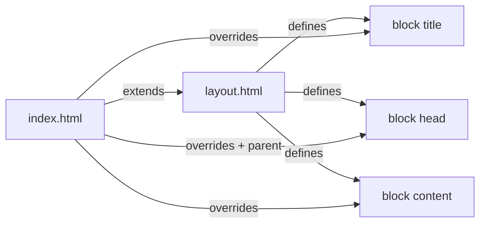

# Getting Started

## Installation

```bash
npm install @rhinostone/swig --save
```

Node.js ≥ 12 is required. Browsers can load the bundled build from `dist/swig.js` — see [Browser Usage](./browser).

:::tip Coming from Jinja2 or Django?
Swig's syntax will feel familiar but is not drop-in compatible — a few constructs (`is defined`, `not in`, `forloop.*`, block-form ``, many filters) fail at parse time. See the [Migration Guide](./migration) before porting existing templates.
:::


## Render your first template

```js
var swig = require('@rhinostone/swig');

// Compile a file, then render it
var tpl = swig.compileFile('/path/to/template.html');
console.log(tpl({ article: { title: 'Swig is fun!' }}));

// Render a string directly
console.log(swig.render('Hooray!', { locals: { foo: true }}));
```

## Variables

Variables are output with `{{ … }}`. All output is autoescaped as HTML by default — see [Filters](./filters) for escape-bypass options and [Security](./security) for the model.

```swig
{{ foo }}
```

### Dot-notation vs bracket-notation

Property access works like JavaScript — use brackets when keys contain non-alphanumeric characters:

```swig
{{ foo.bar }}
{{ foo['bar'] }}           {# equivalent #}
{{ foo['chicken-tacos'] }} {# must use brackets #}
```

`{{ foo.chicken-tacos }}` would be parsed as subtraction (`foo.chicken - tacos`).

### Undefined and falsy values

An undefined variable renders as an empty string. Falsy values (`null`, `false`, `0`) render as their natural string form.

### Filters

Filters transform variables. Chain them with `|`:

```swig
{{ name|title }} was born on {{ birthday|date('F jS, Y') }}
{# => Jane was born on July 6th, 1985 #}
```

See the full [Filters reference](./filters).

### Functions

Variables can also be functions — function output is **never autoescaped**, regardless of the `autoescape` option:

```js
var locals = { mystuff: function () { return '<p>Things!</p>'; } };
swig.render('{{ mystuff() }}', { locals: locals });
// => <p>Things!</p>
```

Pipe through `|escape` (or `|e`) to enforce escaping:

```swig
{{ mystuff()|escape }}
```

## Logic tags

Tags wrap control flow (`if`, `for`, `block`, `include`, …). Syntax is ``:

```swig
bar


  <ol>
  <li>{{ person.name }}</li>
  </ol>

```

End tags may include extra context (Swig ignores it) — useful for scoping:

```swig

  ...

```

Full list in the [Tags reference](./tags).

## Comments

```swig
{# This block is removed before rendering. #}
```

## Whitespace control

Whitespace is preserved as-is. To strip whitespace around a tag, add a dash adjacent to the open/close mark (no space between the dash and the `%`):

```swig
{# seq = [1, 2, 3, 4, 5] #}

  {{ item }}

{# => 12345 #}
```

## Template inheritance

Swig supports layout inheritance via `` and ``.



**`layout.html`**

```swig
<!doctype html>
<html>
<head>
  <meta charset="utf-8">
  <title>My Site</title>
  
  <link rel="stylesheet" href="main.css">
  
</head>
<body>
  
</body>
</html>
```

**`index.html`**

```swig


My Page


  
  <link rel="stylesheet" href="custom.css">



<p>This is just an awesome page.</p>

```

`` emits the parent block's content — useful when overriding a block to append rather than replace.

## Using Swig with Express

```js
var app = require('express')();
var swig = require('@rhinostone/swig');

app.engine('html', swig.renderFile);
app.set('view engine', 'html');
app.set('views', __dirname + '/views');

// Swig caches compiled templates. Let one cache be authoritative —
// either Express's or Swig's, not both.
app.set('view cache', false);
swig.setDefaults({ cache: 'memory' });

app.get('/', function (req, res) {
  res.render('index', { /* template locals */ });
});

app.listen(1337);
```

In production, keep at least one cache enabled. Setting both to `false` recompiles every template on every request.

## Next steps

- [Template Syntax](./syntax) — detailed reference for every expression form.
- [Tags](./tags) — all 15 built-in tags with examples.
- [API](./api) — programmatic API for custom tooling.
- [CLI](./cli) — pre-compile templates from the command line.
