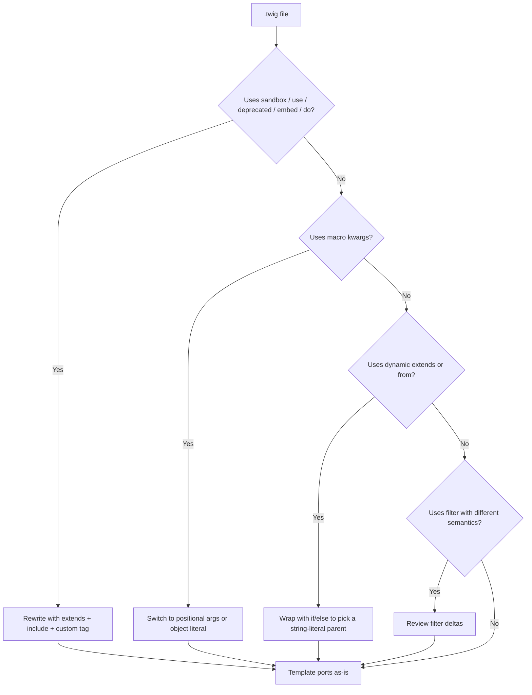

# Migrating from upstream PHP Twig

This guide is for teams with existing `.twig` templates written against [upstream PHP Twig 3.x](https://twig.symfony.com/doc/3.x/) who want to render them under Node.js via `@rhinostone/swig-twig`.

**Short version:** most Twig templates port cleanly. The operator set, tag set, filter set, and inheritance model are deliberately the same shape. The gaps are concentrated in three areas — filter semantics, runtime model, and unsupported tags — all covered below.

## Porting checklist



Walk the tree top-to-bottom for each `.twig` file. The [Non-Goals](./non-goals) page has the complete list of parse-time rejections with error messages.

## What ports cleanly

Straight copy-paste — no changes needed:

- `{{ var }}`, `{{ var.path.to.field }}`, `{{ array[0] }}`
- `{{ a + b }}`, `{{ a * b }}`, `{{ a ~ b }}` (string concat)
- `{{ a ?? b }}` (null-coalesce), `{{ a ?: b }}` (Elvis), `{{ cond ? a : b }}`
- `` / `` / `` / ``
- `` with the magic `loop.*` variables (`loop.index`, `loop.first`, `loop.last`, `loop.length`)
- `` including body form `…`
- `` with `` overrides
- `` including `with { … } only` variants
- ``, ``, ``
- `…`, `…`, `…`
- `is defined`, `is null`, `is empty`, `is iterable`, `is odd`, `is even`, `is divisibleby(n)`
- String interpolation: `"Hello #{name}"`

## Semantic differences

### `replace` filter

Upstream Twig accepts a `{from: to}` object map:

```twig
{# upstream Twig #}
{{ "I love %this% and %that%"|replace({"%this%": "apples", "%that%": "oranges"}) }}
```

swig-twig **matches this shape exactly** — the object-map form ports as-is. If you are coming from templates that pass a regex (the native swig shape), you will need to rewrite them as a substitution map.

| Source | Shape | swig-twig accepts? |
| --- | --- | --- |
| Upstream PHP Twig | `{'old': 'new'}` | Yes |
| Native `@rhinostone/swig` | `replace(regex, sub)` | No — use object-map form |

### `date` filter

swig-twig's `date` filter uses the PHP-style format tokens documented under [native swig's `date` filter](../filters) (shared with `@rhinostone/swig-core`). Most format strings port — `"Y-m-d H:i:s"`, `"U"`, etc. — but locale-aware names (weekday names, month names in non-English locales) are not plumbed through. If you rely on locale switching, pre-format on the controller side and pass the string into the template.

`date_modify` is not implemented — see [Non-Goals](./non-goals#other-known-gaps).

### Macros

Positional calls port unchanged. Keyword-argument calls do not — see [Non-Goals — macro kwargs](./non-goals#macro-kwargs) for the rewrite pattern.

### Autoescape

`autoescape` is `true` by default, the same as upstream PHP Twig. The escape strategies diverge slightly:

| Strategy | Upstream Twig | swig-twig |
| --- | --- | --- |
| `html` | Default. | Default. |
| `js` | Supported. | Supported via `escape('js')`. |
| `css` | Supported. | Not implemented — use `escape('js')` + a CSS-specific context. |
| `url` | Supported via `url_encode`. | Supported via `url_encode`. |
| `html_attr` | Supported. | Not implemented — `escape('html')` is usually sufficient for quoted attribute values. |

If you rely on `css` or `html_attr`, register a custom filter — mark it `.safe = true` on the function before passing it to `setFilter`:

```js
function cssEscape(input) { /* your CSS-safe escape */ }
cssEscape.safe = true;
twig.setFilter('css_escape', cssEscape);
```

See [Extending Swig](../extending) for the registration contract.

### Template inheritance

Two semantic differences from upstream:

- **Parent paths must be string literals.** See [Non-Goals — dynamic extends](./non-goals#dynamic--extends--and--from-). The `` / `` workaround covers the common "pick one of N layouts" case.
- **`` (horizontal reuse) is not implemented.** See [Non-Goals — unsupported tags](./non-goals#unsupported-tags). Use `` + `` composition.

### Runtime model

Upstream Twig runs inside PHP with the full PHP runtime reachable (object method calls, iterator interfaces, `__toString`, etc.). swig-twig compiles each template to a JavaScript function and runs it under `new Function(...)` — **the runtime is the JS runtime**, with its own coercion rules and iteration semantics.

Practical consequences:

- **Object method calls require JS functions.** `{{ user.getName() }}` works if `user.getName` is a JS function; it does not fall back to a PHP magic `__call`.
- **Iteration is over enumerable JS own properties.** `` yields `Object.keys(obj)` order — which is insertion order for string keys in modern JS engines.
- **Stringification uses `String(x)`.** Objects without a custom `toString` render as `"[object Object]"` rather than throwing. If you rely on upstream Twig's `__toString` magic, define `toString` on the locals object before passing it in.

### Shared backend guarantees

Everything below is inherited from `@rhinostone/swig-core` and behaves identically across all frontends (native swig, swig-twig, future Jinja2/Django):

- **CVE-2023-25345 guards.** `__proto__`, `constructor`, and `prototype` are rejected at parse time in variable output, dot access, bracket access (string literals), and all context-writing tags (`set`, `for`, `macro`, `import`, `from`). See [Security — known advisories](../security#known-advisories).
- **Autoescape injection.** The final `e` filter is appended automatically to every variable output unless the filter chain ends in a `.safe = true` filter.
- **Isolation.** Tags, filters, and extensions registered on one instance are invisible to other instances — same guarantee as native swig. See [Security — design invariants](../security#security-model).
- **Cache semantics.** Compiled functions are keyed by the loader-resolved filename. See [Loaders](../loaders) for the contract.

## When to stay on upstream PHP Twig

If you need any of the following, upstream is still the right tool:

- `` with a custom security policy.
- Horizontal template reuse via `` or ``.
- Deep integration with Symfony's runtime (injected services, form rendering helpers, `humanize_bytes`-style i18n filters).
- Locale-aware `date` / `number_format` without pre-formatting on the controller side.

swig-twig is designed for teams rendering Twig-syntax templates from Node.js — typically as part of a migration off PHP, or for a mixed PHP/Node stack that wants a single template dialect.

## Reporting a porting gap

If a template that works under upstream PHP Twig 3.x parses cleanly in swig-twig but produces different output, that is a bug — please [open an issue on `gina-io/swig`](https://github.com/gina-io/swig/issues) with the smallest reproducer you can distil. Parse-time rejections that you think should be supported are also welcome — track against the [Non-Goals](./non-goals) rationale and make the case for promoting.
